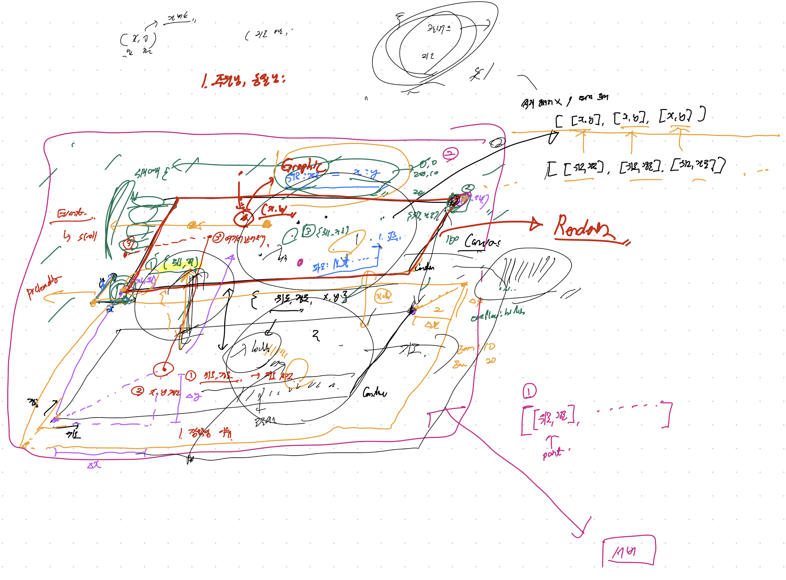
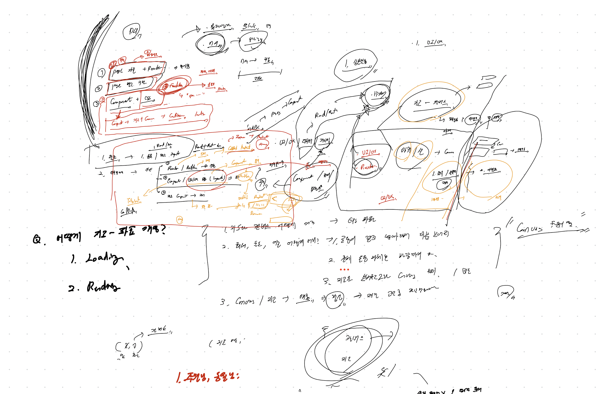

> 템플릿의 목적 → 회의를 최대한 효율적이고 알차면서 빠르게 끝내기.
그러면서도 확실하게 논의할건 논의하고 넘어가기.
> 

## 📝 회의 목표

- 개발 착수하기 위한 사전 논의 사항을 마무리 짓는다.

## 📝 회의 안건

- 일정 산출을 마무리 한다.
- 역할 분배를 확실히 한다.
- 작업 상황을 최대한 공유할 수 있는 방안을 마련한다.
- 캔버스와 지도 간의 동작 방식을 정의한다.

## 📝 회의가 끝났을 때의 상태

- 한 주간의 일정 산출이 끝났다. (배포를 기준으로 어떻게 할 건지 정의했다.)
- 역할 분배를 확실히 했다.
- 작업 상황을 공유할 수 있는 중간 장치를 만들었다.
- 캔버스와 지도 간의 동작 방식을 정의했다.

## 📝 회의 내용

### ⚙️ ESLint에 대한 불편사항 존재

#### 💻 Frontend

- `no-param-reassign`에 대한 고민 → `useRef` 사용 과정에서 에러가 발생했고 재할당 과정에서 문제가 발생했다.

#### 💾 Backend

- `file extension` 인식 문제가 발생했다. → js 사용하는데 붙이면 오류나고, 안붙여도 오류난다.

### ⚙️ 지도에 대한 설정 내용



- 캔버스와 지도는 다음과 같은 데이터만 주고 받는다.
    
    ```tsx
    interface data = {
    	latitude: number,
    	longitude: number,
    }
    ```
    
    - canvas에 전체 좌표를 로딩하고 이걸 이동하는 방식을 채택한다.
    - 지도가 이동하거나 축소 시 좌표정보를 기반으로 재 연산을 시작한다.
    - 캔버스와 지도 간의 딜레이 등은 일단 구현하고 생각한다. (다음주로 미룸)

### ⚙️ 역할 분배는 어떻게 할 것인가?



#### 🤔 문제 상황

- 프론트의 작업 진도가 너무 느리다. + 백로그가 대부분 처리되고 있지 않다.

#### 🤔 논의할 사항

- 데모 시연을 위해서는 `Router`를 기반으로 빠르게 `Pages` 구조가 잡혀야 한다.
- `Tailiwind CSS`를 위한 `Compound`가 빠르게 설정되어야 한다.
- 이를 기반해서 정적 `UI/UX`가 먼저 구현이 되어야 한다.
- 공통 컴포넌트는 페이지를 구현하면서 빠르게 나와야 한다.
- 이 모든 작업은 이번주에 끝나고 배포가 이루어져야 한다.
- 백앤드는 이번주에 끝내고, 이후에는 J234 정혜인이 프론트에 붙어서 작업한다.

## 📝 결론

1. `ESLint` 및 `TSConfig`에서의 불편사항이 존재 ⇒ `J210 임재도`가 점심 때 빠르게 수정
2. 프론트 작업 분배는 다음과 같이 진행
    - `React-Router` 를 기반으로 한 `path` 와 `page` 설정 → `J060 김주원`
    - `Tailwind css Compound` + `공통 컴포넌트` → `J174 김동율`
    - 지도 설정 및 공통 컴포넌트 개발(Drawer) → `J210 임재도`
3. 위의 과정은 다음의 조건을 따름
    - 내일까지 완수
    - 깃허브 프로젝트에 이슈를 만들고, 이에 따라서 테스크를 전부 업로드
    - 이후에 개발 (작업상황 공유 및 다른 팀원이 작업 마치면 빠르게 붙게 할 수 있기 위함)
4. 작업 진행의 원활한 소통을 위해서 다음의 규칙 추가
    - 매일 7시 (부스트캠프 코어시간의 종료시간)에 현재 작업 상황 보고
    - 데일리 스크럼때 화면공유하고 작업상황 공유

## 📝 기타

- 개발 진행상황 빠르게 뽑아내고, 이후에 docs 작성하는 방법 `J210 임재도`가 명세