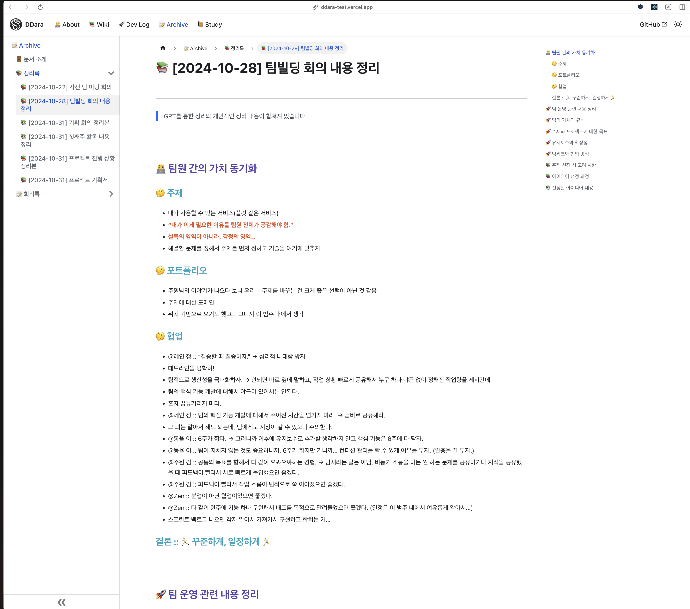

import ReactPlayer from 'react-player'

## 🏃 데일리 스크럼

### 🤔 오프닝 질문 :: J210 - 주말동안 먹었던 음식중에 제일 맛있게 먹은게 무엇인가요…?

@주원 김 쿠팡에서 훈제연어 시켜서 홀스래디쉬 소스와 양파와 함께 먹었습니다.

- @Zen :: 와 이분도 혼자 맛난거 많이드셨네… ⇒ 요리해먹으신건가요?
    - @주원 김 :: 그대로 꺼내먹었습니다
- @혜인 정 :: 연어 회식때 먹어요

@동율 이 :: 친구들과 육회

- @Zen :: 술은 얼마나 드셨나여? 이게 메인이잖아요. 보통 육회면… 이자카야…?
    - @동율 이 :: 과음해버림..
    - @Zen :: 소주?
- @주원 김 :: 이자카야면 데이트인데 까비 ⇒ @Zen :: 이자카야를 데이트하러 가십니까…?!

@Zen :: 일단 내가 만든 파스타. 다시 요리 시작했는데 넘넘 꿀맛이라 행복합니다. 그리고 그 정호연 쉐프가 하는 우동집인가 가서 먹었는데.. 역대 최악의 맛. 정호연 쉐프가 유튜브하는데 이제 안믿기로 함. 자기
프차관리 너무 못함… (토마토 라임 소바) → 먹으면 먹을수록 최악… 라임 특유의 쓴맛이 우러나서.. 국물이 써요… 돈도 비쌈.. 돈아깝… 이돈 두끼 2번..

- 백종원 아재… 자기프차관리 최악… 이번에 상장했던데… 개미들 애도…

@혜인 정 :: 저 진짜 많이 먹었어요. 물회도 먹었고 방어랑 광어도 먹었고, 투썸 케이크도 두조각 먹었는데 맛있었고…..군만두도 먹었는데 맛있었어요…./

- @Zen :: 포항 물회가 그렇게 맛있다던데…. 와…. 그런 맛있는걸 혼자만….? 와…
- @주원 김 :: 그렇다면 19일에 기대하겠습니다.
- @Zen :: 물회에 밥…? 🤮 ⇒ 부산이 다 섞어먹는것과 비슷한 맥락…
- @주원 김 :: 오이냉국에 밥 말아 먹는 기분 ⇒ 🤮
- @동율 이 :: 원래는 밥을 안 말아 먹군요..? 경상도 사람이라 당연하게 생각했는데
    - @Zen :: 스프에 밥말아먹는거 어케 생각하세요? ⇒ @혜인 정 :: 저는 절대 안먹지만 존중해요..
        - @주원 김 :: 괜찮은거 같아요.
        - @동율 이 :: 에바..
        - @Zen :: 사실 군대에서 많이 먹었는데…. 이사람들이…. 마상….

### 🧑‍💻 J060 김주원

#### 🗣️ 주말동안 한 일

> 아이스브레이킹 용도입니다. 편하게 적어주세요!
>

#### 🗣️ 현재 작업 상황

- 블로그 작성
    - 개발환경
    - vitest storybook ⇒ @Zen :: VItest로 선그리거나 하는 테스트 방법이나 작성 법에 대한 문서 정리 부탁드립니다… 저도 테스트해보고 싶어요.
- 바텀시트 개발중

<ReactPlayer playing controls url="/video/20241111-dailyscrum.mp4"></ReactPlayer>

#### 🗣️ 한 주간 목표

- 바텀시트
    - storybook
    - 재사용성 높이기
- 선그리기 vitest
- 로그인 모달 구현?

#### 🗣️ 오늘 할 일

- 바텀시트
    - 스토리북

### 🧑‍💻 J174 이동율

#### 🗣️ 주말동안 한 일

> 아이스브레이킹 용도입니다. 편하게 적어주세요!
>

- 하루는 술마시고 놀았읍니다…ㅎㅎ

#### 🗣️ 현재 작업 상황

- 경로 추가 페이지 UI 구현
- 점찍기 및 다른 곳 찍으면 점찍기 구현 완료
- 어처구니 없는 실수로 시간 엄청 날림
- 캔버스로 이것 저것 하고 있는데, 로직 여러개 생각
- 위도 경도를 좌표로 변환 → 네이버 지도 api 함수로 → 네이버 지도에 종속
- 지도 컴포넌트도 종속되지 않게 하려고 useRef 사용해서 컴포넌트에서 설정해줬더니 lint때문에 커밋 불가
- 캔버스 확대 축소 구현하신분 있으시면 참고하려 했지만 아직 아무도 pr이 없어서..

#### 🗣️ 한 주간 목표

- 마커 기능 구현
- 경로 추가 상태 관리

#### 🗣️ 오늘 할 일

- 캔버스 마커 삭제 및 이동 구현

### 🧑‍💻 J210 임재도

#### 🗣️ 주말동안 한 일

> 아이스브레이킹 용도입니다. 편하게 적어주세요!
>

- 환경설정 및 문서 자동화를 이뤘습니다. 만세!
    - 자동화 과정에서 설정 충돌로 20시간 넘게 쓴듯해요.. 흑흑..
- 네이버 지도 API 분석을 했고, 조금 커먼하게 사용할 수 있도록 손보는 중 입니다. → Lint ⇒ 이제는 풀면되는 단계. 그래서 논의하고, 풀생각입니다.

#### 🗣️ 현재 작업 상황

- 네이버지도 API를 리액트에서 사용할 수 있도록 커먼한 유틸과 훅으로 만드는 중입니다.
- 이거 작업 이후에 공통 컴포넌트 개발하고 레이어 겹쳐서 출력하는 거 해볼 예정입니다.

#### 🗣️ 한 주간 목표

- 화면 구현과 네이버 지도 포팅, 그리고 그 위에서 좌표와 동시에 움직일 수 있도록 기능테스트까지 하는게 목표입니다.
- 데모정도는 보여줘봐야죠. (필수인거 같음)

#### 🗣️ 오늘 할 일

- 일정 잡기
- 네이버 지도 API 매핑 및 개발 진도 뺴기
- 리액트 및 스토리북 공부좀 해두기
- 문서 작성

### 🧑‍💻 J234 정혜인

#### 🗣️ 주말동안 한 일

> 아이스브레이킹 용도입니다. 편하게 적어주세요!
>

친구가 포항으로 놀러왔어요 … 그래서 놀다가 어제 저녁에는 6시에 잤어요………..

#### 🗣️ 현재 작업 상황

- db 설계 및 구축
- swagger 세팅

#### 🗣️ 한 주간 목표

- 백엔드 끝내기 ⇒ @Zen :: CI/CD 하시나요? 필요하다면 vercel로 배포해도 될거같아요.(임시로) || 도커면 Jenkins 인가요? DockerCompose나, Makefile 만드나요? 개인적으로는
  혜인님에게 다 맡기고 싶긴해요.
    - @Zen :: 백앤드하면서 CI/CD는 챙겨가는게 좋다고 생각해서. Jenkins 면 끝남. → 배포관련된 빌드명령어나, 각종 명령어를 제가 이미 셋팅함. 쉘스크립트 작성만… Jenkins는
      payload를 짜긴해야겠지만..
    - @Zen :: Action도 괜찮습니다.
    - @Zen :: Supabase…? 결론은 혜인님이 완전 잘하신걸루…! 대박! 👍
    - @Zen :: 맞아요. 저한테도 설치같은건 걍 다 빠르게 있는 이미지써서 할 줄 알았다고… ⇒ 우린 몰랐죠.. NCP 가 그렇게 … (헙…!)
- 데모정도는 보여줘봐야죠. (필수인거 같음)

#### 🗣️ 오늘 할 일

- socket 사용하여 실시간 위치 파악
- 로그인 api 구현