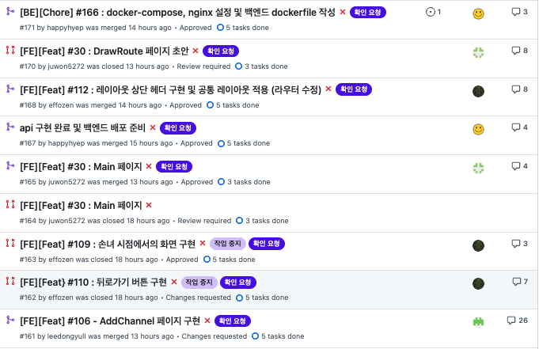
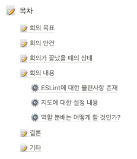
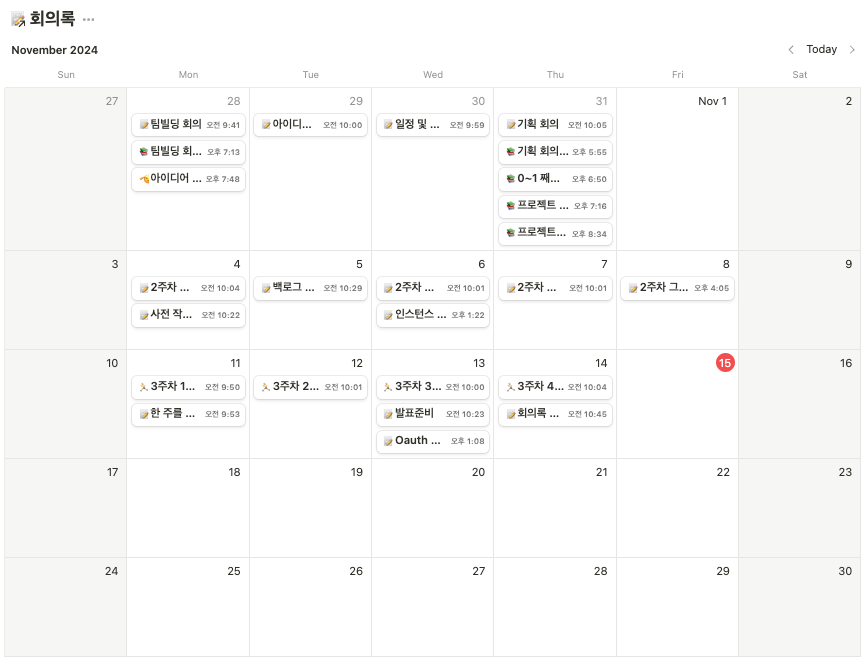
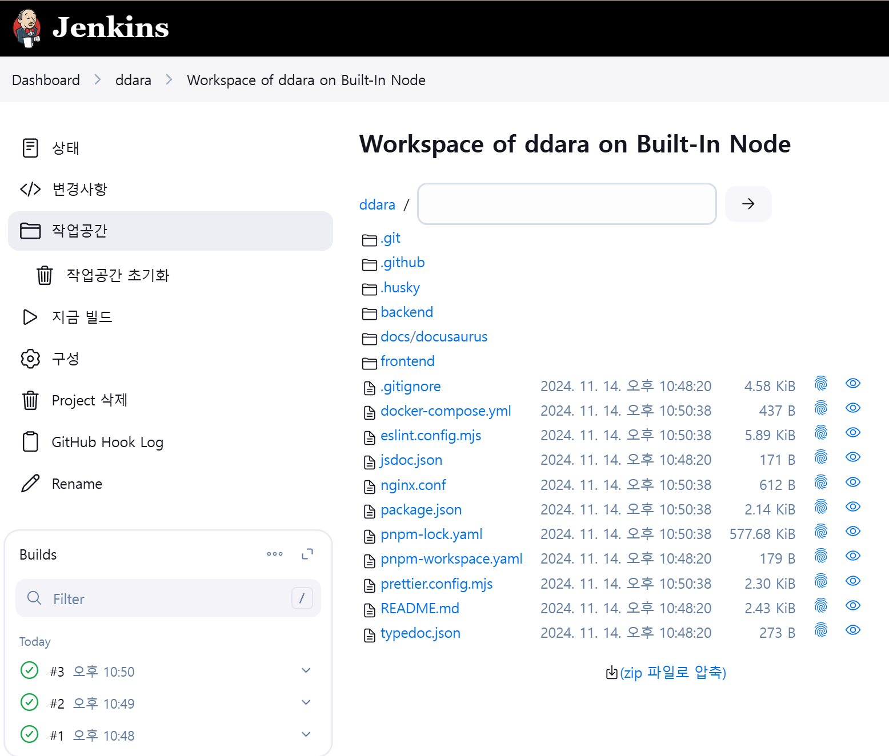
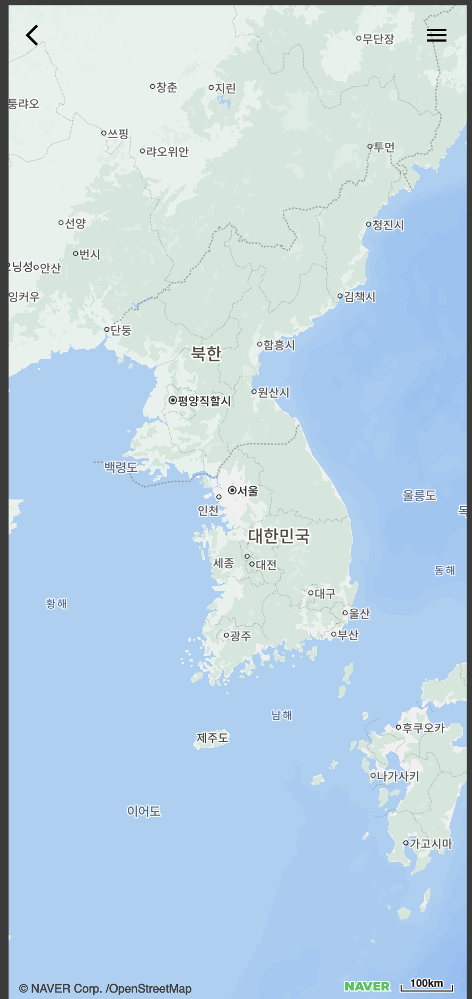
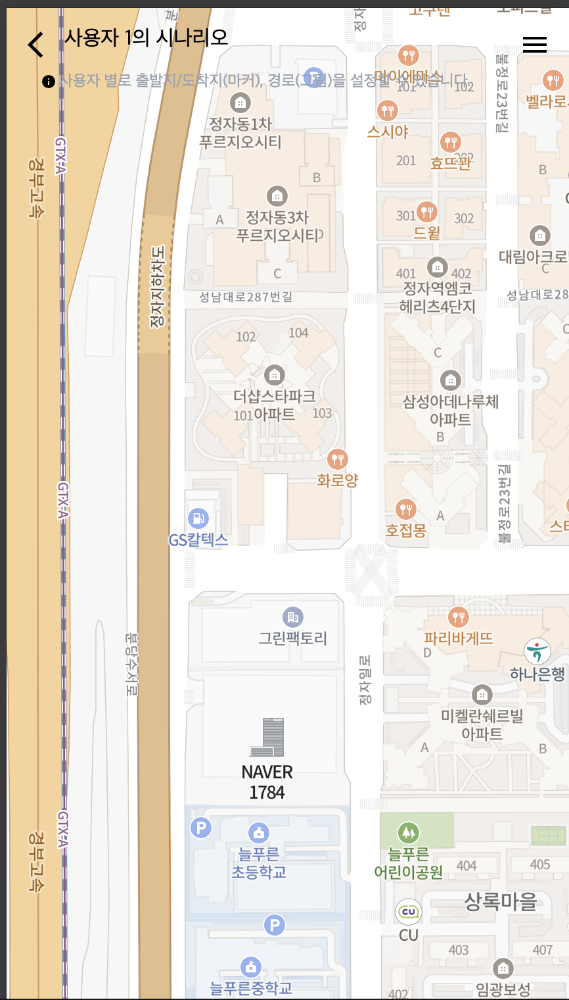
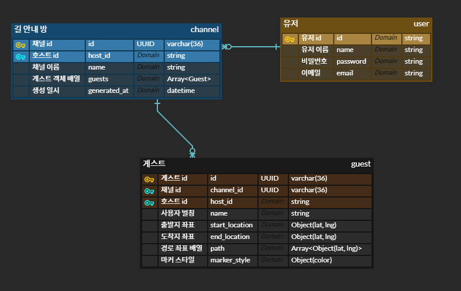
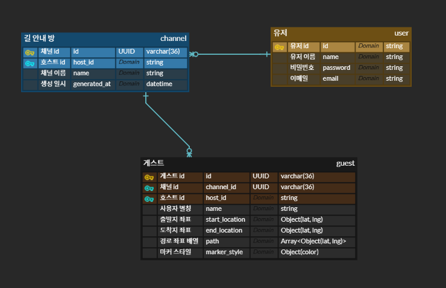
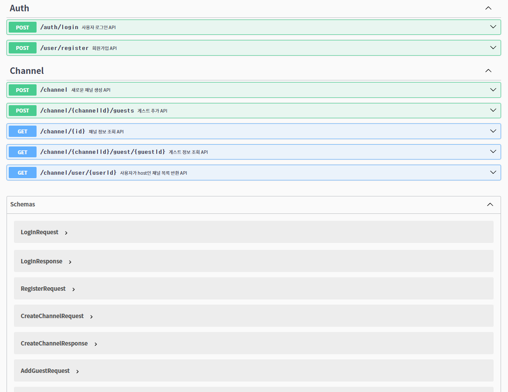
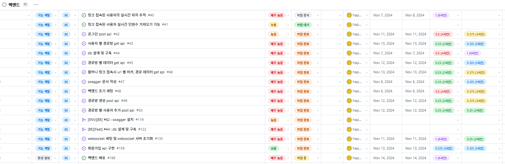

## 📝 주제 요약

### 중장년층 대상 길안내 웹서비스

- 설명 : 조부모님이 올라오실때 어디만큼 오셨는지 확인하고, 길을 지도에 그려드려서 길안내를 해드릴 수 있는 웹사이트
- 주요 기능
  - 조부모님의 위치 실시간 추적
  - 길안내를 위한 저작도구
  - 지도와 캔버스 동기화

## 📝 팀 개발 문화 요약

### **팀4명이 FE → 서로의 코드를 이해하기 쉽다**

- PR은 최소 2명이 approve 해야한다

→ 깃허브 액션을 통해 PR이 들어오면, 확인요청 라벨과 함께 랜덤으로 리뷰어 2명씩 할당

;

### **문서화에 신경쓰자**

- 문서를 아예 따로 관리하자. ⇒ 추후 TypeDoc, Storybook, Swagger, JSDoc 등도 이에 통합 계획

[선따라길따라](https://ddara-docs.vercel.app/archive/intro)

- storybook 작성


import ReactPlayer from "react-player";

<ReactPlayer playing controls url="/docs/archive/summary/20241113-3week-presentation/video/20241114-3week-presentation_video1.mov"></ReactPlayer>

- TSDoc

```jsx
  // BottomSheet TSDoc

  /**
   * `BottomSheet` 컴포넌트는 하단에서 올라오는 시트 형태의 UI를 제공합니다.
   *
   * @param {IBottomSheetProps} props - `children`을 포함한 컴포넌트 속성
   * @param {number} props.minHeight - Bottom Sheet의 최소 높이를 화면 비율로 나타냅니다 (0.0 - 1.0).
   * @param {number} props.maxHeight - Bottom Sheet의 최대 높이를 화면 비율로 나타냅니다 (0.0 - 1.0).
   * @param {ReactNode} props.children - Bottom Sheet 내부에 렌더링할 콘텐츠입니다.
   * @returns {ReactNode} - 하단 시트를 렌더링합니다.
   *
   * @remarks
   * - 드래그 동작을 통해 시트를 열고 닫을 수 있습니다.
   * - `useBottomSheet` 훅을 사용하여 위치 및 드래그 동작을 관리합니다.
   * - `minHeight`는 Bottom Sheet가 닫힌 상태의 높이 비율을 나타냅니다.
   * - `maxHeight`는 Bottom Sheet가 열린 상태의 최대 높이 비율을 나타냅니다.
   *
   * @example
   * ```tsx
   * <BottomSheet minHeight={0.5} maxHeight={0.85}>
   *   <div className="p-4">
   *     <h2>예시 콘텐츠</h2>
   *     <p>BottomSheet의 children</p>
   *   </div>
   * </BottomSheet>
     * ```
*/
```

```tsx
/**
   * 사용자 위치를 가져오는 커스텀 Hook입니다.
   *
   * @returns {IGetUserLocation} 사용자 위치 (위도, 경도)와 에러 메시지를 포함한 객체를 반환합니다.
   *
   * @remarks
   * - Geolocation API를 사용하여 사용자의 현재 위치를 가져옵니다.
   * - 위치를 성공적으로 가져오지 못하면 기본 위치 네이버 1784 (37.3595704, 127.105399)로 설정됩니다.
   * - Geolocation API가 지원되지 않는 경우에도 기본 위치로 설정됩니다.
   *
   * @example
   *
   * const { lat, lng, error } = getUserLocation();
   *
   * if (error) {
   *   console.error('위치 가져오기 에러:', error);
   * } else {
   *   console.log('현재 위치:', lat, lng);
   * }
   *
*/
```

- 문서 작성 템플릿 만들기

<div style={{width:'40%', marginLeft:'auto', marginRight:'auto',}}>

  

</div>

- 데일리 스크럼, 회의록, 모두 기록

<div style={{width:'60%', marginLeft:'auto', marginRight:'auto',}}>

  

</div>


## 📝 한 주의 계획

### 🎯 팀 전체의 목표

- UI/UX 구현 및 백앤드 로직 구현 다 해서, 정적파일들 위주로 배포
- 다음주에는 지도와 캔버스에만 집중할 수 있도록 환경 구축 끝내기

### 🎯 FE 목표

- UI/UX 피그마에 나온 대로 구현
- `shadcn` 등을 활용하지 않고, 컴포넌트 하나하나 직접 구현

### 🎯 BE 목표

- 백엔드 API 구현 및 다음주부터 프론트로 넘어갈 수 있도록 모든 작업 다 끝내기
- 백엔드 배포

## 📝 계획이 얼마나 달성되었는가

### 🎯 FE 목표

- 85프로 달성 (세부적인 디테일은 아직 보완사항으로 남음)
  - 더미데이터 파일로 빼두어야함
  - 공통 컴포넌트 적용 → 개발중인게 머지 되면 적용 예정

### 🎯 BE 목표

- 95프로 달성
  - 필요한 모든 api 구현 완료
  - 백엔드 배포 완료 (docker + docker compose + nginx + naver cloud server)
  - swagger 문서 작성 완료
  - jenkins로 배포 자동화 → 고민중




- 백엔드 배포 url (swagger 문서)

[http://223.130.151.43:3001/api-docs/#/](http://223.130.151.43:3001/api-docs/#/)


## 📝 FE 개발 내용 (페이지별로)

### 💻 메인화면 구축


<ReactPlayer playing controls url="/docs/archive/summary/20241113-3week-presentation/video/20241114-3week-presentation_video2.mov"></ReactPlayer>

- Header, Map → 공통 컴포넌트
- bottomsheet
  - storybook
  - TSDoc
- bottomsheet 내부 content
  - storybook
  - TSDoc

### 💻 선그리기화면 구축

<ReactPlayer playing controls url="/docs/archive/summary/20241113-3week-presentation/video/20241114-3week-presentation_video3.mov"></ReactPlayer>

### 💻 손녀화면 구축

<div className="image-row">


</div>

- 공통 컴포넌트 및 레이아웃 구현
- 현재 문서화 작업 중

  - [**🎨 Header 컴포넌트로 확인하는 내가 컴포넌트를 설계하고 구현하는 방식**](https://fantasmith.com/react_lab/dev-log/header)
  - [**🖥️React, TypeScript, Tailwind로 Dropdown 구현하기**](https://fantasmith.com/react_lab/dev-log/dropdown)

### 💻 사용자 추가 화면 구축

- 최대 5명의 사용자를 만들 수 있다
- 사용자를 삭제할 수 있다
  - 사용자3을 삭제하면 사용자4가 사용자3이 된다

<ReactPlayer playing controls url="/docs/archive/summary/20241113-3week-presentation/video/20241114-3week-presentation_video4.mov"></ReactPlayer>


## 📝 BE 개발 내용

### DB 테이블 설계 수정

왼쪽 사진에서 오른쪽 사진으로 수정하였습니다.

`channel` 테이블의 `게스트 객체 배열`이 비효율적이고 불필요하다는 판단에 제거하였습니다.

<div className="image-row">


</div>

- 고민 과정 포스팅 내용

- [PostgreSQL 데이터베이스 설계 고민: Channel 테이블에 Guests 정보를 포함할지](https://velog.io/@happyhyep/PostgreSQL-%EB%8D%B0%EC%9D%B4%ED%84%B0%EB%B2%A0%EC%9D%B4%EC%8A%A4-%EC%84%A4%EA%B3%84-%EA%B3%A0%EB%AF%BC-Channel-%ED%85%8C%EC%9D%B4%EB%B8%94%EC%97%90-Guests-%EC%A0%95%EB%B3%B4%EB%A5%BC-%ED%8F%AC%ED%95%A8%ED%95%A0%EC%A7%80)

### API 구현 목록

- 사용자 로그인 API
- 회원가입 API
- 새로운 채널 생성 API
- 게스트 추가 API
- 채널 정보 조회 API
- 게스트 정보 조회 API
- 사용자가 host인 채널 목록 반환 API

```javascript
// 채널 정보
{
  "id": "string",
  "name": "string",
  "host_id": "string",
  "guests": [
    {
      "id": "string",
      "name": "string",
      "start_location": {
        "lat": 0,
        "lng": 0
      },
      "end_location": {
        "lat": 0,
        "lng": 0
      },
      "path": [
        {
          "lat": 0,
          "lng": 0
        }
      ],
      "marker_style": {
        "color": "string"
      }
    }
  ]
}
```

### swagger 문서 작성



### - 배포 (docker + docker-compose + nginx + ncloud)

`Error [ERR_MODULE_NOT_FOUND]: Cannot find package 'express'`


### 주간 백로그 현황



### - [BE] 트러블 슈팅 및 기록

[▸ ESLint 오류 해결기: await을 for...of 반복문에서 사용하지 않기](https://velog.io/@happyhyep/ESLint-%EC%98%A4%EB%A5%98-%ED%95%B4%EA%B2%B0%EA%B8%B0-await%EC%9D%84-for...of-%EB%B0%98%EB%B3%B5%EB%AC%B8%EC%97%90%EC%84%9C-%EC%82%AC%EC%9A%A9%ED%95%98%EC%A7%80-%EC%95%8A%EA%B8%B0)
[▸ PostgreSQL 데이터베이스 설계 고민: Channel 테이블에 Guests 정보를 포함할지](https://velog.io/@happyhyep/PostgreSQL-%EB%8D%B0%EC%9D%B4%ED%84%B0%EB%B2%A0%EC%9D%B4%EC%8A%A4-%EC%84%A4%EA%B3%84-%EA%B3%A0%EB%AF%BC-Channel-%ED%85%8C%EC%9D%B4%EB%B8%94%EC%97%90-Guests-%EC%A0%95%EB%B3%B4%EB%A5%BC-%ED%8F%AC%ED%95%A8%ED%95%A0%EC%A7%80)
[▸ PostgreSQL에서 생성 시간 자동 설정하기 (generated_at의 NOT NULL 제약 조건)](https://velog.io/@happyhyep/PostgreSQL%EC%97%90%EC%84%9C-%EC%83%9D%EC%84%B1-%EC%8B%9C%EA%B0%84-%EC%9E%90%EB%8F%99-%EC%84%A4%EC%A0%95%ED%95%98%EA%B8%B0-generatedat%EC%9D%98-NOT-NULL-%EC%A0%9C%EC%95%BD-%EC%A1%B0%EA%B1%B4)
[▸ 비밀번호 검증 오류 해결기](https://velog.io/@happyhyep/%EB%B9%84%EB%B0%80%EB%B2%88%ED%98%B8-%EA%B2%80%EC%A6%9D-%EC%98%A4%EB%A5%98-%ED%95%B4%EA%B2%B0%EA%B8%B0)
[▸ PostgreSQL 스키마로 인한 오류 해결하기](https://velog.io/@happyhyep/PostgreSQL-%EC%8A%A4%ED%82%A4%EB%A7%88%EB%A1%9C-%EC%9D%B8%ED%95%9C-%EC%98%A4%EB%A5%98-%ED%95%B4%EA%B2%B0%ED%95%98%EA%B8%B0)
[▸ Node.js WebSocket 연결 문제 해결기](https://velog.io/@happyhyep/Node.js-WebSocket-%EC%97%B0%EA%B2%B0-%EB%AC%B8%EC%A0%9C-%ED%95%B4%EA%B2%B0%EA%B8%B0)

## 📝 다음주 목표

- 지도와 캔버스의 연동
- 저작도구 기능 완성
- 로그인